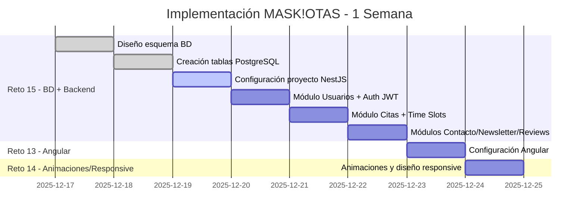

# Diagrama de Gantt - MASK!OTAS Veterinaria
**Desarrollador:** Tobias  
**Duración:** 1 semana (17-23 Dic 2025)

---

---

## 📅 Cronograma Semanal

| Día | Fecha | Tarea | Reto | Estado |
|-----|-------|-------|------|--------|
| **Lunes** | 17 Dic | Diseño BD (8 tablas: users, appointments, countries, cities, etc.) | Reto 15 | ✅ |
| **Martes** | 18 Dic | Implementación tablas PostgreSQL + scripts | Reto 15 | ✅ |
| **Miércoles** | 19 Dic | Setup NestJS + TypeORM + configuración | Reto 15 | 🔄 |
| **Jueves** | 20 Dic | Auth JWT + CRUD Usuarios | Reto 15 | ⏳ |
| **Viernes** | 21 Dic | API Citas + Time Slots | Reto 15 | ⏳ |
| **Sábado** | 22 Dic | APIs Contacto, Newsletter, Reviews | Reto 15 | ⏳ |
| **Domingo** | 23 Dic | Inicio proyecto Angular + estructura base | Reto 13 | ⏳ |
| **Lunes** | 24 Dic | Animaciones y diseño responsive | Reto 14 | ⏳ |

---

## 📦 Entregables por Reto

### Reto 15: Base de Datos + Backend NestJS (✅ BD / 🔄 Backend)
- ✅ **Base de Datos:** 8 tablas (`countries`, `cities`, `users`, `appointments`, `time_slots`, `contacts`, `newsletter_subscriptions`, `reviews`)
- ✅ Scripts SQL de creación y migración
- ✅ 100+ ciudades, 10+ países precargados
- 🔄 Estructura base NestJS + TypeORM
- ⏳ Autenticación JWT
- ⏳ 6 módulos REST (Usuarios, Citas, Contacto, Newsletter, Reviews, Ubicaciones)

### Reto 13: Frontend Angular (⏳ Planificado)
- ⏳ Configuración inicial del proyecto
- ⏳ Estructura de componentes y rutas
- ⏳ Integración con Backend

### Reto 14: Animaciones y Responsive (⏳ Planificado)
- ⏳ Animaciones y transiciones
- ⏳ Diseño responsive para móviles

---

## 👤 Equipo

**Desarrollador:** Tobias (Full-Stack)

---

## 🛠️ Stack Tecnológico

- **BD:** PostgreSQL
- **Backend:** NestJS + TypeORM + JWT
- **Frontend:** Angular 17

---

**Actualizado:** 17 Diciembre 2025
