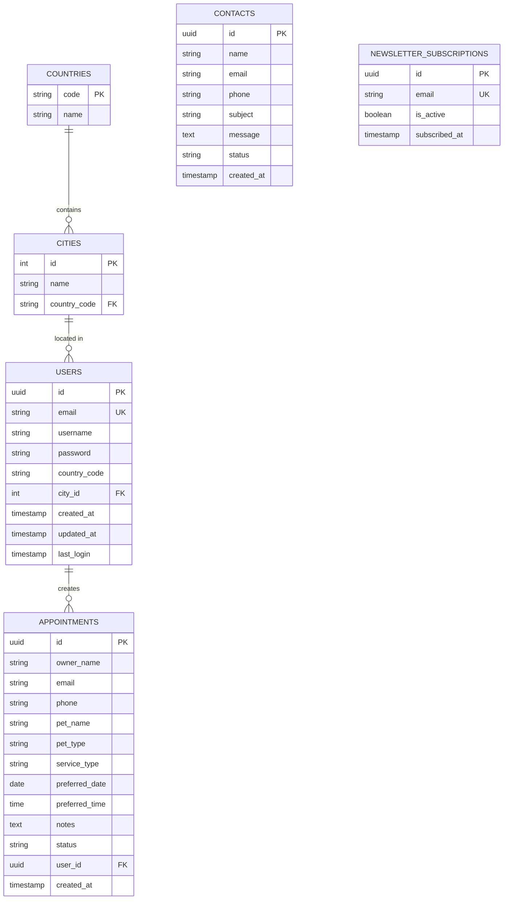

# 📚 Documentación del Backend - MASK!OTAS

## 📋 Índice
- [Visión General](#visión-general)
- [Arquitectura](#arquitectura)
- [Stack Tecnológico](#stack-tecnológico)
- [Módulos del Sistema](#módulos-del-sistema)
- [Base de Datos](#base-de-datos)
- [API Endpoints](#api-endpoints)
- [Configuración](#configuración)
- [Despliegue](#despliegue)

---

## 🎯 Visión General

Backend desarrollado con NestJS para la aplicación web de la clínica veterinaria MASK!OTAS. Proporciona una API RESTful robusta para gestionar usuarios, citas, ubicaciones geográficas, contactos y suscripciones al newsletter.

### Características Principales
- ✅ Autenticación JWT
- ✅ Validación de datos con class-validator
- ✅ ORM TypeORM con PostgreSQL
- ✅ CORS habilitado para desarrollo
- ✅ Prefijo global `/api` para todas las rutas
- ✅ Manejo centralizado de errores
- ✅ Logging de queries en desarrollo

---

## 🏗️ Arquitectura

### Patrón de Diseño
El backend sigue la arquitectura modular de NestJS basada en:
- **Módulos**: Agrupación lógica de funcionalidades
- **Controladores**: Manejo de peticiones HTTP
- **Servicios**: Lógica de negocio
- **Entidades**: Modelos de datos con TypeORM
- **DTOs**: Validación y transformación de datos

### Estructura de Carpetas
```
src/
├── auth/              # Autenticación y autorización
│   ├── auth.controller.ts
│   ├── auth.service.ts
│   ├── auth.module.ts
│   ├── jwt.strategy.ts
│   └── dto/
├── users/             # Gestión de usuarios
│   ├── users.controller.ts
│   ├── users.service.ts
│   ├── users.module.ts
│   └── user.entity.ts
├── appointments/      # Sistema de citas
│   ├── appointments.controller.ts
│   ├── appointments.service.ts
│   ├── appointments.module.ts
│   └── appointment.entity.ts
├── location/          # Países y ciudades
│   ├── location.controller.ts
│   ├── location.service.ts
│   ├── location.module.ts
│   ├── country.entity.ts
│   └── city.entity.ts
├── contact/           # Formulario de contacto
│   ├── contact.controller.ts
│   ├── contact.service.ts
│   ├── contact.module.ts
│   └── contact.entity.ts
├── newsletter/        # Suscripciones newsletter
│   ├── newsletter.controller.ts
│   ├── newsletter.service.ts
│   ├── newsletter.module.ts
│   └── newsletter.entity.ts
├── app.module.ts      # Módulo raíz
└── main.ts            # Punto de entrada
```

---

## 🛠️ Stack Tecnológico

### Core
- **Framework**: NestJS 10.x
- **Runtime**: Node.js 18+
- **Lenguaje**: TypeScript 5.x

### Base de Datos
- **DBMS**: PostgreSQL 14+
- **ORM**: TypeORM 0.3.x
- **Migraciones**: Manual (SQL scripts)

### Autenticación
- **Estrategia**: JWT (JSON Web Tokens)
- **Biblioteca**: @nestjs/jwt + passport-jwt
- **Hash de contraseñas**: bcrypt

### Validación
- **class-validator**: Validación de DTOs
- **class-transformer**: Transformación de datos

### Utilidades
- **@nestjs/config**: Variables de entorno
- **cors**: Manejo de CORS

---

## 📦 Módulos del Sistema

### 1. AuthModule
**Propósito**: Gestión de autenticación y autorización

**Funcionalidades**:
- Registro de usuarios
- Inicio de sesión
- Generación de tokens JWT
- Validación de tokens
- Protección de rutas

**Endpoints**:
- `POST /api/auth/register` - Registro de usuario
- `POST /api/auth/login` - Inicio de sesión
- `GET /api/auth/profile` - Obtener perfil (protegido)

**Entidades relacionadas**: User

---

### 2. UsersModule
**Propósito**: Gestión de información de usuarios

**Funcionalidades**:
- CRUD de usuarios
- Búsqueda por email
- Actualización de perfil
- Gestión de ubicación (país/ciudad)

**Entidades**:
```typescript
User {
  id: UUID
  email: string (unique)
  username: string
  password: string (hasheado)
  country_code: string (opcional)
  city_id: number (opcional)
  created_at: timestamp
  updated_at: timestamp
  last_login: timestamp
}
```

---

### 3. AppointmentsModule
**Propósito**: Sistema de gestión de citas veterinarias

**Funcionalidades**:
- Crear nueva cita
- Listar citas del usuario autenticado
- Ver detalles de cita
- Cambiar estado de cita

**Endpoints**:
- `POST /api/appointments` - Crear cita
- `GET /api/appointments/my-appointments` - Mis citas (protegido)
- `GET /api/appointments/:id` - Detalles de cita (protegido)

**Entidades**:
```typescript
Appointment {
  id: UUID
  owner_name: string
  email: string
  phone: string
  pet_name: string
  pet_type: string ('perro' | 'gato' | 'otro')
  service_type: string ('consulta' | 'vacunacion' | 'peluqueria' | 'emergencia')
  preferred_date: date
  preferred_time: time
  notes: text (opcional)
  status: string ('pending' | 'confirmed' | 'cancelled' | 'completed')
  user_id: UUID (opcional, FK a users)
  created_at: timestamp
}
```

---

### 4. LocationModule
**Propósito**: Gestión de países y ciudades

**Funcionalidades**:
- Listar países disponibles
- Listar ciudades por país
- Seed inicial de datos geográficos

**Endpoints**:
- `GET /api/location/countries` - Listar países
- `GET /api/location/cities/:countryCode` - Ciudades por país
- `POST /api/location/seed` - Poblar datos iniciales

**Entidades**:
```typescript
Country {
  code: string (PK, 3 caracteres)
  name: string
}

City {
  id: number (auto-increment)
  name: string
  country_code: string (FK a countries)
}
```

**Datos Pre-cargados**:
- 10 países (España, USA, México, Argentina, Colombia, Francia, Reino Unido, Alemania, Italia, Portugal)
- 100 ciudades (10 por cada país)

---

### 5. ContactModule
**Propósito**: Gestión de mensajes del formulario de contacto

**Funcionalidades**:
- Recibir mensajes de contacto
- Gestión de estado de mensajes

**Endpoints**:
- `POST /api/contact` - Enviar mensaje

**Entidades**:
```typescript
Contact {
  id: UUID
  name: string
  email: string
  phone: string (opcional)
  subject: string
  message: text
  status: string ('pending' | 'responded' | 'archived')
  created_at: timestamp
}
```

---

### 6. NewsletterModule
**Propósito**: Gestión de suscripciones al newsletter

**Funcionalidades**:
- Suscribirse al newsletter
- Validación de email único

**Endpoints**:
- `POST /api/newsletter/subscribe` - Suscribirse

**Entidades**:
```typescript
NewsletterSubscription {
  id: UUID
  email: string (unique)
  is_active: boolean (default: true)
  subscribed_at: timestamp
}
```

---

## 🗄️ Base de Datos

### Diagrama de Relaciones



### Índices Importantes
```sql
-- Users
CREATE INDEX idx_users_email ON users(email);
CREATE INDEX idx_users_city ON users(city_id);

-- Appointments
CREATE INDEX idx_appointments_user ON appointments(user_id);
CREATE INDEX idx_appointments_date ON appointments(preferred_date);
CREATE INDEX idx_appointments_status ON appointments(status);

-- Cities
CREATE INDEX idx_cities_country ON cities(country_code);

-- Newsletter
CREATE INDEX idx_newsletter_email ON newsletter_subscriptions(email);
CREATE INDEX idx_newsletter_active ON newsletter_subscriptions(is_active);

-- Contacts
CREATE INDEX idx_contacts_status ON contacts(status);
CREATE INDEX idx_contacts_created ON contacts(created_at);
```

### Triggers
```sql
-- Actualizar updated_at automáticamente
CREATE TRIGGER update_users_updated_at 
    BEFORE UPDATE ON users
    FOR EACH ROW 
    EXECUTE FUNCTION update_updated_at_column();
```

---

## 🔌 API Endpoints

### Autenticación

#### POST /api/auth/register
Registrar nuevo usuario

**Request Body**:
```json
{
  "email": "user@example.com",
  "username": "usuario123",
  "password": "password123",
  "countryCode": "ESP",
  "cityId": 1
}
```

**Response** (201):
```json
{
  "access_token": "eyJhbGciOiJIUzI1NiIsInR5cCI6IkpXVCJ9...",
  "user": {
    "id": "uuid",
    "email": "user@example.com",
    "username": "usuario123"
  }
}
```

#### POST /api/auth/login
Iniciar sesión

**Request Body**:
```json
{
  "email": "user@example.com",
  "password": "password123"
}
```

**Response** (200):
```json
{
  "access_token": "eyJhbGciOiJIUzI1NiIsInR5cCI6IkpXVCJ9...",
  "user": {
    "id": "uuid",
    "email": "user@example.com",
    "username": "usuario123"
  }
}
```

#### GET /api/auth/profile
Obtener perfil del usuario autenticado

**Headers**: `Authorization: Bearer <token>`

**Response** (200):
```json
{
  "id": "uuid",
  "email": "user@example.com",
  "username": "usuario123",
  "country_code": "ESP",
  "city_id": 1,
  "created_at": "2024-01-01T00:00:00Z"
}
```

---

### Ubicaciones

#### GET /api/location/countries
Listar todos los países

**Response** (200):
```json
[
  { "code": "ESP", "name": "España" },
  { "code": "USA", "name": "Estados Unidos" },
  ...
]
```

#### GET /api/location/cities/:countryCode
Listar ciudades de un país

**Parameters**: `countryCode` (string, 3 caracteres)

**Response** (200):
```json
[
  { "id": 1, "name": "Madrid", "countryCode": "ESP" },
  { "id": 2, "name": "Barcelona", "countryCode": "ESP" },
  ...
]
```

---

### Citas

#### POST /api/appointments
Crear nueva cita

**Request Body**:
```json
{
  "ownerName": "Juan Pérez",
  "email": "juan@example.com",
  "phone": "+34 123 456 789",
  "petName": "Max",
  "petType": "perro",
  "serviceType": "consulta",
  "preferredDate": "2024-12-15",
  "preferredTime": "10:30",
  "notes": "Primera consulta"
}
```

**Response** (201):
```json
{
  "id": "uuid",
  "status": "pending",
  "created_at": "2024-12-08T10:00:00Z",
  ...
}
```

#### GET /api/appointments/my-appointments
Listar citas del usuario autenticado

**Headers**: `Authorization: Bearer <token>`

**Response** (200):
```json
[
  {
    "id": "uuid",
    "pet_name": "Max",
    "preferred_date": "2024-12-15",
    "preferred_time": "10:30:00",
    "status": "pending"
  },
  ...
]
```

---

### Newsletter

#### POST /api/newsletter/subscribe
Suscribirse al newsletter

**Request Body**:
```json
{
  "email": "user@example.com"
}
```

**Response** (201):
```json
{
  "message": "Suscripción exitosa",
  "subscription": {
    "id": "uuid",
    "email": "user@example.com",
    "subscribed_at": "2024-12-08T10:00:00Z"
  }
}
```

---

### Contacto

#### POST /api/contact
Enviar mensaje de contacto

**Request Body**:
```json
{
  "name": "María García",
  "email": "maria@example.com",
  "phone": "+34 987 654 321",
  "subject": "Consulta sobre servicios",
  "message": "Me gustaría obtener más información..."
}
```

**Response** (201):
```json
{
  "message": "Mensaje enviado correctamente",
  "contact": {
    "id": "uuid",
    "status": "pending",
    "created_at": "2024-12-08T10:00:00Z"
  }
}
```

---

## ⚙️ Configuración

### Variables de Entorno

Archivo `.env`:
```bash
# Servidor
PORT=3000
NODE_ENV=development

# Base de Datos
DATABASE_HOST=localhost
DATABASE_PORT=5432
DATABASE_USER=postgres
DATABASE_PASSWORD=tu_password
DATABASE_NAME=maskotas_db

# JWT
JWT_SECRET=tu_secret_key_muy_segura
JWT_EXPIRATION=7d

# CORS
CORS_ORIGIN=http://localhost:4200
```

### Configuración de TypeORM

```typescript
// app.module.ts
TypeOrmModule.forRootAsync({
  useFactory: (configService: ConfigService) => ({
    type: 'postgres',
    host: configService.get('DATABASE_HOST'),
    port: configService.get('DATABASE_PORT'),
    username: configService.get('DATABASE_USER'),
    password: configService.get('DATABASE_PASSWORD'),
    database: configService.get('DATABASE_NAME'),
    entities: [User, Country, City, Appointment, Contact, NewsletterSubscription],
    synchronize: false, // ⚠️ IMPORTANTE: false en producción
    logging: configService.get('NODE_ENV') === 'development',
  }),
})
```

### Configuración de CORS

```typescript
// main.ts
app.enableCors({
  origin: process.env.CORS_ORIGIN || 'http://localhost:4200',
  credentials: true,
});
```

---

## 🚀 Despliegue

### Desarrollo Local

```bash
# 1. Instalar dependencias
npm install

# 2. Configurar variables de entorno
cp .env.example .env
# Editar .env con tus valores

# 3. Crear base de datos
psql -U postgres -c "CREATE DATABASE maskotas_db;"

# 4. Ejecutar script de creación de tablas
psql -U postgres -d maskotas_db -f recreate-database.sql

# 5. Iniciar en modo desarrollo
npm run start:dev
```

### Producción

```bash
# 1. Build
npm run build

# 2. Configurar variables de entorno de producción
# NODE_ENV=production
# synchronize=false en TypeORM

# 3. Iniciar
npm run start:prod
```

### Scripts Disponibles

```bash
npm run start          # Iniciar (producción)
npm run start:dev      # Iniciar con watch mode
npm run start:prod     # Iniciar build de producción
npm run build          # Compilar TypeScript
npm run lint           # Lint con ESLint
npm run test           # Tests unitarios
npm run test:e2e       # Tests end-to-end
```

---

## 🔒 Seguridad

### Medidas Implementadas

1. **Contraseñas**: Hash con bcrypt (10 rounds)
2. **JWT**: Tokens firmados con secret key
3. **Validación**: DTOs con class-validator
4. **CORS**: Configurado para orígenes permitidos
5. **SQL Injection**: Protección con TypeORM parametrizado
6. **XSS**: Sanitización automática de inputs

### Recomendaciones para Producción

- ⚠️ Cambiar `JWT_SECRET` a un valor aleatorio fuerte
- ⚠️ Configurar `synchronize: false` en TypeORM
- ⚠️ Habilitar HTTPS
- ⚠️ Implementar rate limiting
- ⚠️ Configurar logs rotatorios
- ⚠️ Usar gestión de secretos (AWS Secrets Manager, etc.)

---

## 📊 Monitoreo y Logs

### Logs en Desarrollo
```typescript
// TypeORM logging habilitado
logging: true

// Logs de queries en consola
SELECT "User"."id" FROM "users" "User" WHERE "User"."email" = $1
```

### Errores Centralizados
Todos los errores HTTP se manejan con el sistema de excepciones de NestJS:
- `BadRequestException` (400)
- `UnauthorizedException` (401)
- `NotFoundException` (404)
- `InternalServerErrorException` (500)

---

## 🧪 Testing

### Estructura de Tests
```
src/
├── auth/
│   ├── auth.service.spec.ts
│   └── auth.controller.spec.ts
├── users/
│   ├── users.service.spec.ts
│   └── users.controller.spec.ts
...
```

### Ejecutar Tests
```bash
# Tests unitarios
npm run test

# Tests con cobertura
npm run test:cov

# Tests E2E
npm run test:e2e
```

---

## 📝 Próximas Mejoras

- [ ] Paginación en endpoints de listado
- [ ] Filtros avanzados para citas
- [ ] Sistema de notificaciones por email
- [ ] Panel de administración
- [ ] Gestión de roles (admin, usuario)
- [ ] Historial de citas
- [ ] Sistema de recordatorios
- [ ] Integración con calendario
- [ ] Upload de imágenes de mascotas
- [ ] Webhooks para integraciones

---

## 👨‍💻 Mantenimiento

### Actualizar Dependencias
```bash
npm outdated
npm update
```

### Migraciones de BD
```bash
# Crear nueva migración
npm run typeorm migration:create -- -n NombreMigracion

# Ejecutar migraciones
npm run typeorm migration:run

# Revertir migración
npm run typeorm migration:revert
```

---

## 📞 Soporte

Para preguntas o issues:
1. Revisar esta documentación
2. Consultar logs del servidor
3. Revisar configuración de variables de entorno
4. Verificar estado de la base de datos

---

**Última actualización**: Diciembre 2024
**Versión del Backend**: 1.0.0
**Versión de NestJS**: 10.x
